# Rcs

Rcs is a set of C and C++ libraries for robot control and simulation. It is written for research purposes and for simulation and analysis in robotics. It contains algorithms for vector-matrix calculations, rigid body kinematics, dynamics, control, physical simulation and more. There are many utilities such as OpenSceneGraph nodes and Qt Guis to support research and testing. 

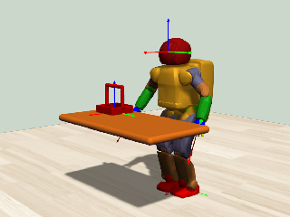 
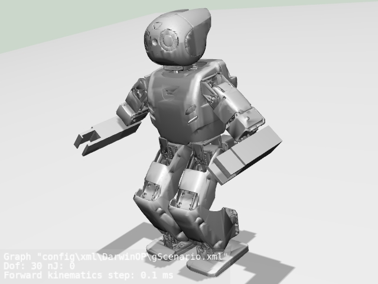 
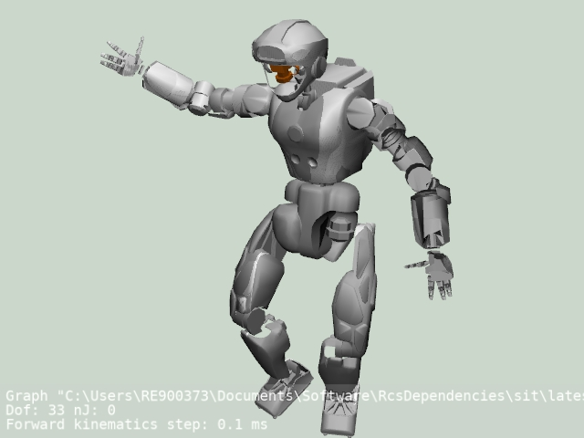 
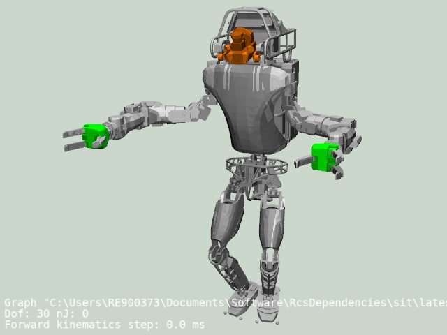 
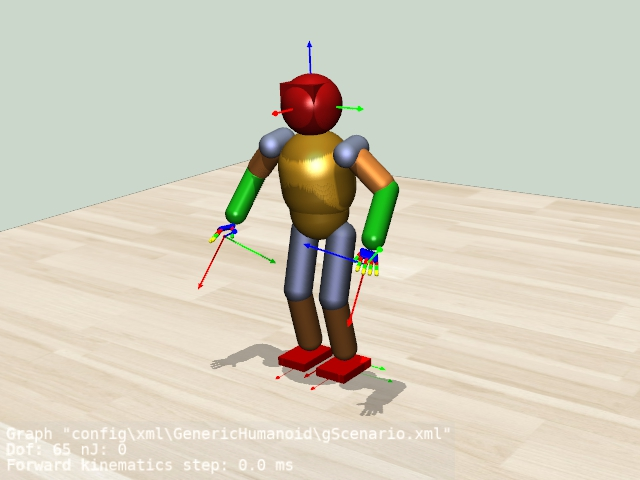

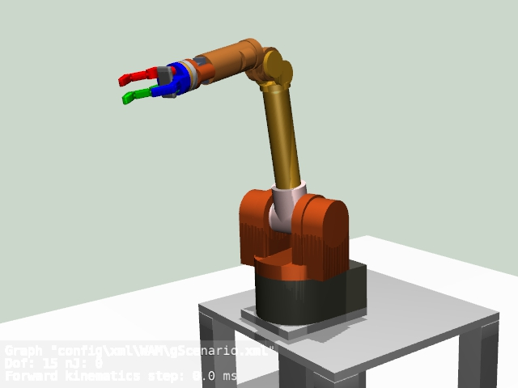 
 
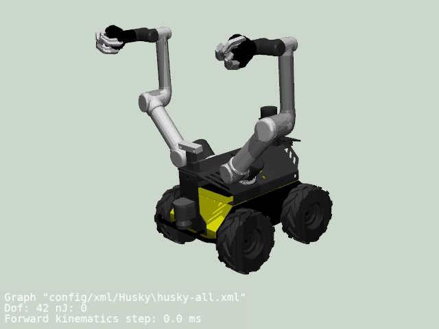 
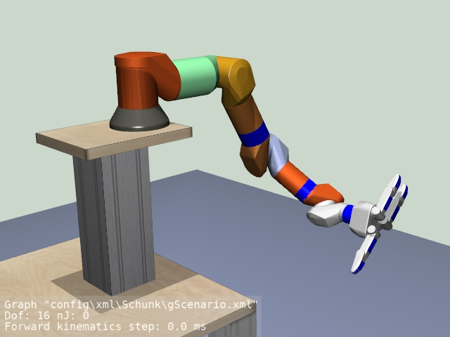 
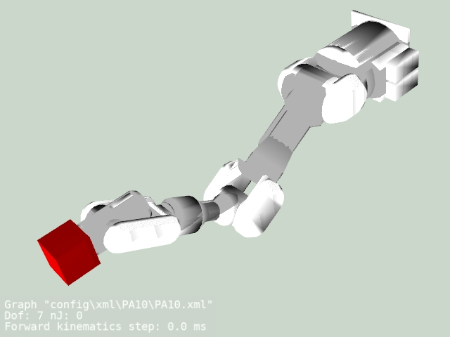 

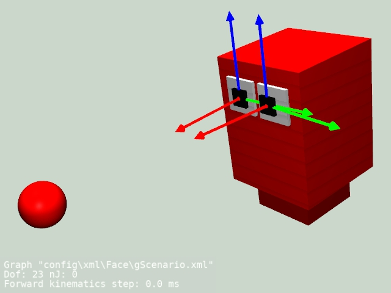 
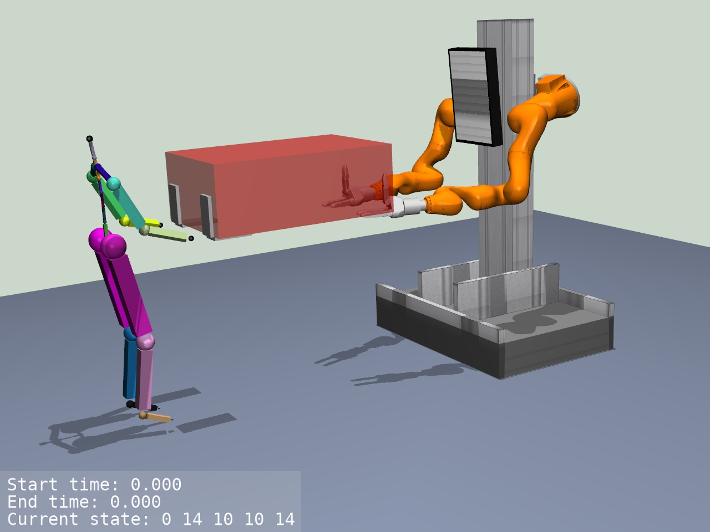 
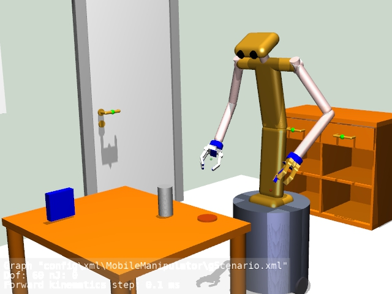
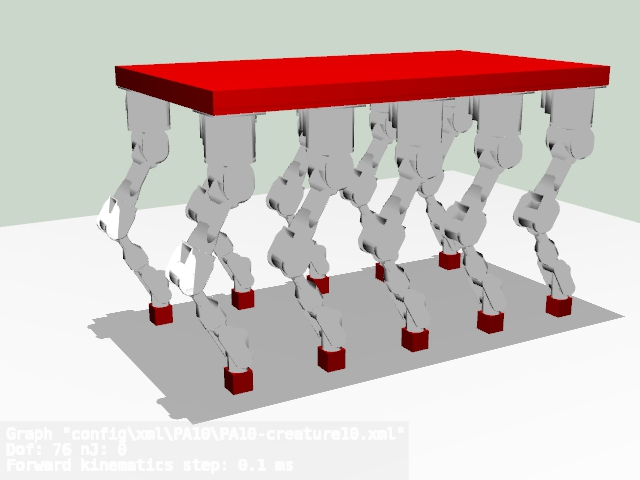 
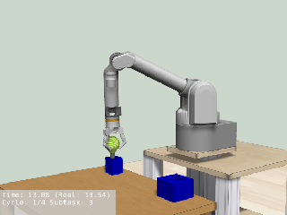

## Getting Started

Rcs can be compiled with the cmake build system and has mainly been developed on Ubuntu 14.04 and GCC 4.8. It does also compile under Ubuntu 16.04 and 18.04 (however Vortex Essentials requires extra care, see comment below). To compile it, just type:

    cd <build-directory>
    cmake <source-directory>
    make 

To build the doxygen documentation, just type:

    make doc

Compilation has also been tested on Ubuntu 16.04 with GCC 5 and Ubuntu 18.04 with GCC 7 and clang. However, Vortex Essentials is only available as pre-compiled binaries using GCC 4.8, so it cannot be used with newer GCC versions. If you install GCC 4.8 on a newer system to work around this issue, you also must  take care to use matching version of OpenSceneGraph, since the one installed via the package manager will not be compatible with GCC 4.8.

It is also possible to compile it on Microsoft Visual Studio, however with some additional efforts. The libxml2 and pthreads library as well as the below mentioned dependencies need to be installed. Further, a cmake version higher than 3.4 is required. They support automatic symbol generation for windows compilation. The formerly mandatory export declaratives are not needed (except for global variables). Here is how to call it:

    cd <build-directory>
    cmake.exe  -DCMAKE_WINDOWS_EXPORT_ALL_SYMBOLS=TRUE -DBUILD_SHARED_LIBS=TRUE -DCMAKE_INSTALL_PREFIX=<install-directory> -DCMAKE_BUILD_TYPE=Release <source-directory> -Wno-dev

## Build options

 - USE_BULLET: Enable bullet physics. With this option, a PhysicsSimulation class that uses Bullet Physics will be built. It can be instantiated through the PhysicsFactory class. Please refer to the documentation. Rcs requires a version equal or higher than 2.83, compiled for double precision, and with shared libraries. Please refer to the Bullet Physics instructions. The default is OFF.
 - USE_WM5: Use the GemoetricTools library (WildMagic5). This will enable a number of functions related to computational geometry, e.g. distance calculation of shape primitives, and ray casts. The default is OFF.
 - USE_VORTEX: Enable Vortex physics. With this option, a PhysicsSimulation class that uses Vortex Essentials (CmLabs) or Vortex with version 6.8 will be built. It can be instantiated through the PhysicsFactory class. Please refer to the documentation. To obtain Vortex Essentials, please refer to the CmLabs web-site. The default is OFF.
 - VORTEX_ESSENTIALS_DIR: Installation directory of Vortex Essentials. Required since there is no standard location for this.
 - USE_EIGEN3: Use the Eigen3 library. This will compile in a number of additional linear algebra functions (See Rcs_eigen3.h for details)
 - ENABLE_DEBUG_MACROS: This option enables logging macros that allow to log information on different debug levels (such as RLOG). If disabled, all these conditional logs are not compiled into the binaries. This usually leads to faster programs, however with the drawback of loosing the information if something goes wrong. The default is ON.
 - ENABLE_C++11: This option sets the corresponding flag so that all code is compiled with the C++11 support. It is not needed from the code, but might be necessary for binary compatibility if other code is compiled for C++11. The default is OFF.
 - HEADLESS_BUILD: Build only RcsCore and RcsPhysics, and leave out all graphics and Gui related classes. If no graphics and Gui libraries are present on the system, you need to call cmake -DHEADLESS_BUILD=TRUE. The default is OFF.

## Project structure

  - bin :             Source files with a main() function
  - cmake :           CMake related configuration files
  - config :          Configuration files such as e.g xml, 
  - doc :             Documentation (doxygen configuration, latex)
  - examples :        Examples with a main() function
  - external :        Third party source code
  - src :             Source files that are compiled into libraries
    - RcsCore :       Algorithms, math, utilities
    - RcsGui :        Qt widgets
    - RcsGraphics :   OpenSceneGraph nodes
    - RcsPhysics :    Bullet and Vortex wrappers

## 3rd party libraries

Rcs has been designed carefully to have only little dependencies. The ones that have been selected are in our opinion very matured libraries:

 - Libxml2 (MIT License, Ubuntu-package libxml2-dev)
 - Qt: LGPL (Also dual commercial license available, Ubuntu-package libqt4-dev)
 - qwt (LGPL with additions, Ubuntu-package libqwt5-qt4-dev)
 - OpenSceneGraph (OSGPL, Ubuntu-package libopenscenegraph-dev)

Optionally (please use the ccmake tool to manage the compile options), additional functionality can be compiled in when activating

 - GeometricTools (Boost Software License 1.0)
 - Bullet Physics (Zlib)
 - Vortex Studio Essentials
 - Eigen3 (Mozilla Public License Version 2.0)

Vortex Studio Essentials is a free version of the dynamics simulation framework by CmLabs. It can be obtained from this web-site: [https://www.cm-labs.com/vortex-studio/vortex-studio-essentials](https://www.cm-labs.com/vortex-studio/vortex-studio-essentials)

## License

This project is licensed under the BSD 4-clause license - see the [LICENSE.md](LICENSE.md) file for details

## Disclaimer

The copyright holders are not liable for any damage(s) incurred due to improper use of Rcs.
